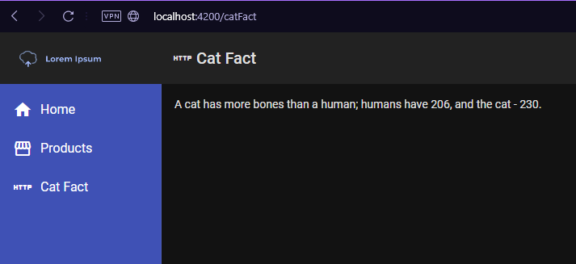

# Compte-rendu Projet We

Auteurs: Gentile Brian & Gombert Gwenael
-

cf readme du projet de base pour voir l'etat de base du projet.

## 1. Setup du projet

### Requirements:
nodejs version: 16.19.1
npm version: 8.19.3

Ce sont les versions que nous avons utiliser pour le projet. A noter que des versions plus récentes ne fonctionneront pas, c'est ce qui nous est arrivé et nous avions du changer de version de nodejs.
Vous pouvez utilisez nvm sous Linux pour changer la version de nodejs que vous utilisez ou nvm-windows sous Windows qui est disponible sur github:
https://github.com/coreybutler/nvm-windows

Installer ensuite yarn avec la commande suivante:
```bash
npm install --global yarn
```
### Lancement du projet

Cloner le projet puis mettez vous dans ce dernier.
```bash
$ git clone https://github.com/BrianGentile/WE_Project.git

$ cd WE_Project
```


La partie backend n'est pas utile à lancer pour voir nos modifications mais voici les instructions pour la lancer:

```bash
$ cd backend

#Installe les dependances
$ yarn

#Lance l'API
$ yarn start
```
Optionnel: A ouvrir dans un navigateur à l'adresse: "localhost:3001"


Pour le frontend:
```bash
$ cd frontend

$ yarn 

$ yarn start
```
A ouvrir dans un navigateur à l'adresse: "localhost:4200"

## 2. Ajout d'un composant angular

Nous avons ajouté un composant "catFact" qui va afficher les données reçues d'une API. Nous nous sommes beaucoup inspiré du travail déjà réalisé par l'auteur du projet et nous avons crée un troisième onglet que l'on peut cliquer et qui va nous envoyer vers la page où l'on va afficher les données.


Nous avons chercher des API dans le même esprit que pokeAPI et nous avons trouver le site https://apipheny.io/free-api. C'est un site qui recense des API gratuites et sans connexion.
(Nous pensons d'ailleurs que c'est un meilleur site que ceux que vous nous avez recommandé car la plupart des APIs de ces sites nous oblige à nous connecter ce qui rajoute de la difficulté)

Nous avons choisi https://catfact.ninja. C'est une API qui envoie des faits sur les chats et nous avons choisi de faire une requête GET pour avoir un fait aléatoire. Ce qui veut dire que vous allez avoir un fait aléatoire à chaque fois que vous allez sur la page ou que vous l'actualisez.





